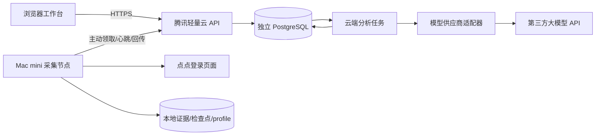

# 应用机会系统 v2：腾讯轻量云 + 第三方大模型 API + Mac mini

更新：2026-09-11。本版为当前架构主文档，补充并修订前两份研究/采集方案。优先级：本版部署职责 > 实页验证报告中的字段事实 > 早期设想。已搭建的代码与目标功能分别列出。

## 1. 产品目标与当前事实

系统服务内部选品：收集国内外应用证据，将竞品线索归并为“目标人群×任务×国家×渠道×变现”的机会，先筛选资格和开发可行性，再安排验证实验。它不自动发布应用，不把榜单表现直接当作可复制收益。

现有账号可看三类市场，但实测一个iOS应用的美国日收入/下载页要求专业版；全球速览只给区间。iOS单榜地区/类别/榜种切换、20→40行滚动、昨天榜单已实测；Google Play美国切换、华为工具及独立鸿蒙榜已实测。完整Top100、稳定DOM脚本、早期历史深度、导出文件尚未验收。

因此系统必须支持“有排名、无收入”正常运转。收入、下载、付费人数、价格、名次变化不得互相代替。模型只能提出研究假设，不能补出缺失观测。

## 2. 对镜析的实际参考

已阅读本机 redbook-video-analysis 的 docs/DEPLOYMENT.md、README.md、cloud/db.js、worker/index.js 和 server/qwen.js，并参考腾讯云部署项目登记。以下为代码/文档参考，不代表本次重新检查镜析生产服务器。

| 镜析实现 | 本系统采用 | 差异 |
|---|---|---|
| 腾讯云API + 独立PostgreSQL + Mac主动HTTPS拉取 | 保留 | 不复用镜析数据库、Token、域名、目录或端口 |
| 60秒租约、15秒心跳、过期重领、最多5次 | 首版代码已实现 | 采集结果幂等入库；付费模型任务另建队列 |
| Mac独立浏览器profile | 保留 | 点点账号资料留Mac，云端不保存Cookie |
| Mac压缩视频并调用千问 | 调整 | 本系统只传结构化应用证据，模型由云端分析进程调用 |
| 完整结果准备好才发布完成 | 保留 | 采集完成不等于分析完成；PARTIAL单独展示 |
| 模型/端点/提示词/输入内容缓存 | 保留 | 证据ID强校验，资格结论必须人工审核 |
| 多用户账号与配额 | 目标阶段采用 | 当前骨架仅一个内部工作空间、管理员令牌；没有假装实现多人隔离 |
| 独立Docker卷、同源Nginx、只暴露回环端口 | 部署模板采用 | 域名/端口/服务器目录必须为本项目单独确定 |

镜析的18082和已有业务18081仅用于识别冲突，不能直接占用。新服务不假定任何相邻端口空闲。

## 3. 三端职责



| 位置 | 保存/执行 | 不依赖 |
|---|---|---|
| 腾讯轻量云 | 任务、账号/工作空间、配置版本、PostgreSQL事实库、趋势计算、机会卡、模型缓存/调用记录 | 不运行点点浏览器，不要求Mac开放公网端口 |
| Mac mini | 浏览器登录、采集配方、串行采集、原始证据、离线缓存、结果回传 | 不持有云端数据库密码或管理员令牌 |
| 模型供应商 | 收到精简证据后做任务归纳、痛点聚类、迁移假设和解释 | 不接收点点Cookie、账号信息、整个浏览器页面或本地文件夹 |
| 用户浏览器 | 查看队列、筛选机会、审阅证据、填写验证反馈 | 模型Key不下发前端 |

当前节点设定一个Mac、一套点点会话。可先共享内部研究工作空间；多人阶段为事实库共享、用户偏好/备注私有，并明确团队权限。未做账号隔离前不向外部用户开放。

## 4. 从输入到输出的完整流程

1. 用户配置国家、渠道、类别、榜种、日期、Top K、每日页面预算和关注任务。配置存版本，不发送任意脚本。
2. 规划器生成 collection_job，request_key 防止重复提交。Mac离线时任务留在云端。
3. Mac领取任务得到随机lease；每15秒续租60秒。节点仅接受本地配方名称，从本机已核验目录加载。未知名称、未核验配方明确失败。
4. 采集时核验 requested/observed 上下文；首批、滚动增量和详情分开取证。不同站点页面共享状态可能变化，任务串行。
5. Mac本地先落盘bundle，再回传。云端校验契约、重复实体、上下文与有效lease，事务保存结果和状态。回传响应丢失可以同lease重复确认；租约过期重新领取后可复用相同输入及配方的本地结果。
6. 标准化流水线将原始bundle拆为排名、档案、内购、区间指标、权限观察。清洗以确定性规则为主，不用模型计算数字。
7. 趋势层按国家/渠道/榜种分组计算。缺失收入保持null；没有数据就输出“证据不足”。
8. 大模型消费带ID的精简证据，输出任务、差异化假设、证据引用及未知项。校验失败不发布机会卡。
9. 资格闸门按功能和目标市场给出待审/排除/可验证；开发者账号已具备不代表政府审批已满足。专项法规依据沿用资质研究并在立项前复核。
10. 用户人工确认候选，填写获客实验、访谈、原型、付费结果；这些数据用于回测研究优先级，不篡改原始观测。

采集与分析必须分别标状态：COLLECTION_SUCCEEDED仅表示采集完成；分析未完成、权限不足、模型配置缺失不应显示为机会报告完成。

## 5. 数据与接口边界

当前新增PostgreSQL表：ac_jobs（请求幂等、payload、租约、次数、状态）、ac_results（job_id唯一、bundle/hash）、ac_nodes（最近轮询）。现有Mac SQLite继续保存本地数据，不能拿它当云端PostgreSQL的双向主库。

下一阶段新增版本化迁移：market_context、app_listing、rank_snapshot、profile_snapshot、metric_observation、listing_relation、opportunity、evidence、analysis_job、model_call、review_feedback。字段细节沿用实页采集方案。鸿蒙实体与供应商返回的安卓详情分开建关系，不能按详情URL合并渠道。

| 已实现接口 | 授权 | 用途 |
|---|---|---|
| GET /healthz | 公开最小状态 | 数据库连通、release、协议版本 |
| POST /api/jobs | 管理员Token | recipe名称+context+request_key创建任务 |
| GET /api/jobs | 管理员Token | 最近100任务；不泄露租约 |
| POST /api/jobs/{id}/cancel | 管理员Token | 取消待执行或运行中任务，旧租约失效 |
| GET /api/jobs/{id}/result | 管理员Token | 已接收的真实bundle |
| POST /worker/claim | 独立节点Token | 领取一个任务，更新最近轮询 |
| POST /worker/jobs/{id}/heartbeat | 节点Token+lease | 续租 |
| POST /worker/jobs/{id}/finish | 节点Token+lease | 校验与幂等回传 |
| POST /worker/jobs/{id}/fail | 节点Token+lease | 明确失败代码 |

现阶段固定mac-1、单工作空间；不是多租户产品。API不提供任意URL抓取、shell执行、上传服务器路径和修改本地配方的能力。请求体上限4MiB；大文件证据上传、分块协议、队列容量配额将在后续实现。

下一阶段UI：总览（节点、采集覆盖、异常）、采集计划、竞品池、任务主题池、机会卡、验证实验、模型配置/调用成本。前端必须基于上述真实接口扩展，不生成假榜单作为默认业务数据。

## 6. 大模型三方API设计

不预设供应商或模型，不复制镜析Key。管理员在服务器本项目配置 AC_LLM_ENDPOINT、AC_LLM_MODEL、AC_LLM_API_KEY。当前适配器支持显式HTTPS的OpenAI兼容chat/completions协议；其他协议以独立适配器实现，不静默切换。

当前代码 app_catch/llm.py：每次最多100条证据、序列化文本40000字符、输出3000 tokens；模型回答需JSON结构、引用已提供的ID、有未知项；成功响应按端点/模型/完整提示词/版本/证据hash缓存。缓存不包含Key。usage缺失时保留null，不编造费用。网络超时不自动重试，避免不确定付费重复。

计划中的云端分析队列：单独进程，从PostgreSQL领取analysis_job；逐日预算预占、成功记录usage、失败/不确定分别结算；成本估算需要供应商实际价格和币种，未配置价格只显示tokens及“金额未知”。当前尚未实现持久预算账本、自动分析调度和模型配置页面，因此API不会自动产生付费调用。适配器已用测试桩验证，未调用真实供应商。

模型分工：小模型/低成本配置做任务标签与评论摘要；更强模型只对候选做迁移假设和解释。具体模型选择以实际接口质量、成本和结构化输出验收为准，不绑定一个未经验证的名称。

## 7. 部署设计

腾讯轻量云：独立Compose项目appcatch，独立PostgreSQL17容器/卷/网络，API单进程。模板默认API、数据库各512MiB上限，是初始资源预算，不是容量结论。公网通过既有Nginx新增本项目站点及TLS，API仅绑定127.0.0.1的确认空闲端口，数据库不发布端口。模型分析runner后续独立服务，可与API同主机。

现有文件：deploy/cloud/Dockerfile、compose.yml、production.env.example；deploy/mac/worker.env.example。部署前确认实例/区域、域名/DNS、空闲端口、目录、Git仓库/提交、剩余资源、独立备份。当前不读取或变更镜析生产配置。当前项目未建立正式发布提交，模板不代表已上线。

本地启动（开发环境、仅回环）：

```bash
python3 -m venv .venv
.venv/bin/pip install '.[cloud]'
# 在本地受限环境配置两个不同的随机Token，均至少32字符；勿写入聊天或Git。
export AC_DATABASE_URL=sqlite:///work/cloud-dev.sqlite
.venv/bin/uvicorn app_catch.cloud:create_app --factory --host 127.0.0.1 --port 8080
```

运行前须已有 AC_ADMIN_TOKEN 与 AC_WORKER_TOKEN；程序没有默认凭据。生产环境AC_ENV=production拒绝SQLite。Mac安装cloud和browser可选依赖，配置HTTPS云端域名、节点Token、独立工作目录、配方目录后，运行 `.venv/bin/python -m app_catch.remote_worker`。配方仍未验证时任务将失败，不会伪造采集成功。

Mac长期运行采用与镜析类似的用户LaunchAgent，正常登录的桌面会话、接电不睡眠、独立profile锁。当前未安装LaunchAgent；FileVault重启解锁、浏览器登录失效仍需人工处理。租约丢失后当前同步采集动作可能继续到本次返回，但不得提交旧结果；后续需补进程取消以避免浪费采集预算。

备份：云端独立pg_dump+外部备份，Mac本地SQLite一致性备份和证据保留策略。浏览器登录资料不进入云端备份。回滚代码不能擅自回滚数据库。第一版create_all只创建缺失表；字段升级需显式版本迁移，不能依赖它升级既有表结构。

## 8. 阶段及验收

| 阶段 | 交付 | 完成标准 |
|---|---|---|
| A 当前底座 | 云端队列、节点协议、模型适配器、部署模板 | 鉴权、过期/取消拒绝、幂等、回传入库；本轮执行本地测试 |
| B 真实采集 | 已验收DOM配方、权限探测、Top100及历史 | 点点真实数据进入云端，随机10行和首尾核对，连续3日 |
| C 机会工作台 | 事实分表、排名趋势、反馈、资格闸门 | 无收入也能产带证据的研究候选，不能输出伪精确增长 |
| D 模型联调 | 分析队列、预算账本、选定供应商、缓存 | 小批真实调用检查ID、费用、重复执行和超时状态 |
| E 云端发布 | TLS、专属服务、Mac常驻、备份与恢复 | 云端与Mac重启恢复；其他项目健康无变化 |

当前范围：A实现了协议骨架；不宣称B–E完成。没有付费调用、没有生产发布、没有复制镜析凭据。

技术参考：[FastAPI认证工具](https://fastapi.tiangolo.com/reference/security/)、[SQLAlchemy事务锁查询](https://docs.sqlalchemy.org/en/20/orm/queryguide/query.html)。实现采用现有Python项目栈；镜析借鉴的是任务协议和部署边界，而非复制视频处理业务。
