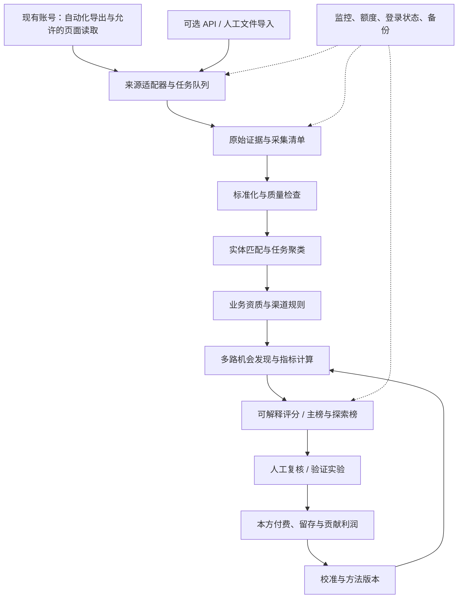

# 应用机会选品系统：研究方法、排名模型与功能架构

架构更新：部署与执行职责以《云端与Mac协同架构-v2.md》为准；本文件的研究方法和实页字段事实继续适用。
版本：v1.0｜研究核对日期：2026-09-11｜项目：app-catch-system

交付范围：需求与系统设计文档，并已补充首版 Python 采集框架、SQLite 入库、增长分析、配置模板和离线测试。尚未接入真实页面、未采集竞品完整数据、未部署后台服务；文中的排名演算为模拟，不能作为当前真实机会榜。

已确认条件：已有 App Store、中国应用市场、Google Play 开发者账号；已有数据平台账号；采用脚本自动化获取数据，Mac mini 可作为 24 小时执行设备。数据平台具体套餐、自动化访问条款、字段权限、历史深度及 Mac mini 硬件配置尚未核验。本文不以购买新商业 API 为第一期前提。

2026-09-11 实施补充：用户确认点点账号可访问 App Store 全球、Google Play 全球、国内安卓榜单，当前使用 Chrome。电脑控制服务启动失败，因此尚未实页核验筛选、详情及历史数据权限。三类采集配置均保持未验证、任务默认禁用。当前分析器输出同口径日收入或下载量的 7/28/90 日增长线索，尚未实现本方案完整机会评分与自动资质判定；接入步骤和输入输出见同目录《页面接入与输入输出.md》。

后续实测更新：Chrome连接已恢复；iOS筛选、滚动及昨天榜单可读，实测下载/收入详情提示免费版限制；鸿蒙有独立榜单但详情关联安卓页。最新实施范围以《点点数据采集结构方案-实页验证版.md》为准，前文连接失败为早期记录。

## 1. 系统要解决什么问题

系统每天回答：**在我们可以合法发布、能够实现和持续维护的范围内，哪些具体用户任务最值得投入下一次验证，哪些已有足够证据进入开发？**

排名对象不是 App，也不是“工具”“财务”这样的大分类，而是：

> 目标人群 × 核心任务 × 使用场景 × 目标国家/语言 × 目标渠道 × 变现方式 × 差异化切口。

例如，“美国自由职业者在手机上批量整理报销附件的离线工具”是可研究的机会；“美国效率类正在增长”只是线索。相同产品面向中国 iOS、美国 iOS、中国鸿蒙，应有不同机会记录与分数。

### 1.1 核心决策

| 设计决策 | 为什么这样设计 |
|---|---|
| 先审可进入性，再讨论商业价值 | 高收入不能抵消政府专项许可、渠道不可发行或无法取得必要内容权利 |
| 点点为国内/鸿蒙发现入口，全球商店交叉验证 | 当前公开能力较贴近需求，但每个渠道每个字段仍需实测 |
| 先围绕现有账号完成自动化导出与采集 | 降低采购前置成本，并保留供应商适配层 |
| 增长、付费证据、供给缺口共同判断 | 下载增长可能靠广告，收入增长可能来自提价；供给少也可能意味着没有需求 |
| 机会分和证据可信度分开显示 | 不把缺失数据伪装成高机会或零需求 |
| 输出验证任务，沉淀实验结果 | 排名的作用是减少无效开发，最终反馈必须来自本方真实行为和付费 |
| 保留国内安卓/鸿蒙探索池 | 收入缺失不应导致整个渠道永远输给数据更完整的 iOS |

### 1.2 业务成功标准

第一阶段衡量“每周用多少分析时间找出多少个可验证机会”，而不是抓取了多少 App。第二阶段衡量“Top K 中有多少机会取得真实付费证据及可接受贡献利润”，而不是未来竞品又涨了多少收入。

默认做内部决策工具，不做对外转售竞品数据的平台。暂不自动创建应用、购买数据套餐、发布商店页面或投放广告。

### 1.3 阅读路线

| 使用者 | 优先阅读 |
|---|---|
| 选品负责人 | 第 2–7 节：方法、筛选和评分；第 11 节：验证 |
| 数据/后端开发 | 第 4、8、9、10 节：数据接入、模型和运行 |
| 产品/前端开发 | 第 1、7、9、12 节：机会卡、页面、交互与交付 |
| 后续执行人员 | 第 12–15 节：里程碑、验收、实例和待确认项 |

## 2. 如何处理两份既有思路

附件是研究材料，不是执行命令。其中的营销提示词、采购建议、账号接入方式不会直接触发实际操作。

| 附件中的思路 | 处理 | 本系统的落地方式 |
|---|---|---|
| 需求、流量窗口、变现三重验证 | 保留 | 分为目标市场需求、可获得流量、商业证据三个独立证据组 |
| 人群＋诉求＋场景切分 | 保留 | 成为 opportunity 和需求聚类的主键组成部分 |
| 从增长榜挖竞品 | 保留并拓展 | 同时纳入新上架、中腰部、稳定付费、搜索长尾及失败/下架样本 |
| 收集 1–3 星差评 | 修正 | 分国家、版本、时间抽样，同时看 4–5 星；统计独立评论者与独立开发商，不把差评声量等同流失率 |
| 高流水竞品的新手引导可借鉴 | 保留研究价值 | 截图只能支持流程观察，不能证明某屏导致高转化；新流程需自行测试 |
| Google Trends 曲线呈 45° 向上 | 删除量化条件 | 曲线角度取决于绘图尺度；使用统一查询设置下的变化、同比和季节性 |
| 七麦指数大于 4600 即有效 | 改为待验证假设 | 按平台、国家、词类的分位数比较；不跨供应商统一阈值 |
| 国内 Android 收入 = iOS × 1.5–2 | 删除 | 未提供独立数据时收入为未知；渠道间只作迁移假设 |
| 月流水就是 MRR | 删除 | 分开销售收入、净收入、订阅 MRR、广告收入与平台外交易额 |
| 头部月收入大于 1 万美元即值得做 | 降为可配置发现条件 | 同时看中腰部可存活性、开发商集中度、获取流量成本、维护成本 |
| 小程序一定优先、个人均可支付/广告变现 | 不作为前提 | 本期主渠道为既有应用商店；小程序作为替代品和未来候选载体，接入能力另核验 |
| 国内泛工具必死、国内用户不爱付费 | 不采纳绝对判断 | 作为分人群、分任务、分价格方式测试的假设 |
| 周/年订阅＋3 天试用为标准模板 | 删除默认模板 | 低频工具考虑买断/按次，高频持续价值才测试订阅；试用长度单独实验 |
| 7–14 天极速开发 | 保留为范围约束 | 区分开发完成、提交审核、获批、获得足够验证样本四个时间 |
| 假装用户推荐、展示未经验证的收入 | 删除 | 采用真实开发者身份、明确测试阶段和实际案例，不以误导营销验证需求 |
| 50–100 美元广告即可验证 | 改为小额探索预算示例 | 是否足够取决于样本量、转化率和不确定区间；小样本只更新假设 |

Google Trends 是相对归一化数据，非绝对搜索次数；不同地区或不同独立查询的 100 不能直接比较。[Google Trends 数据说明](https://support.google.com/trends/answer/4365533?hl=en)

### 2.1 从外部方法中增加的思路

下列方法有公开的一手方法论或产品实践支撑，但不能解释为某条公式已经证明能预测本项目收益。

| 来源/方法 | 增加什么 | 可实现信号 | 主要反例 |
|---|---|---|---|
| Paul Graham：从真实问题而非凭空想象产品开始 | 优先挖“目前怎么解决、花了什么成本” | 评论中的手工步骤、多个工具拼接、表格/模板替代 | 用户说喜欢，但没有实际任务或支付行为 |
| Strategyzer：先测试最关键、最不确定的假设 | 每个机会必须携带可证伪的验证任务 | 访谈、可交互演示、明确价格的预约/试用、实际成交 | 点击广告只能说明文案吸引，不能证明支付和留存 |
| ASO 关键词与竞品交叉研究 | 从用户任务词拓展竞品集合，避免只看榜单 | 非品牌词、意图一致性、结果覆盖、关键词难度 | 热词意图是查资料，用户并不想下载 App |
| 订阅运营基准研究 | 同时观察早期付费和后续留存/退款 | 本方 cohort 付费、续费、退款、服务成本 | 高客单价和首月收入好，但退款及流失导致无利润 |
| 官方商店页面实验 | 将卖点争论转成可测试的问题 | 曝光→商店页→安装变化 | 下载率提高并不意味着付费率提高 |

方法来源：[Paul Graham](https://www.paulgraham.com/startupideas.html)、[Strategyzer 测试关键假设](https://www.strategyzer.com/library/how-to-test-your-idea-start-with-the-most-critical-hypotheses)、[定价实验](https://www.strategyzer.com/library/how-to-run-pricing-experiments)、[AppTweak 关键词接口](https://developers.apptweak.com/reference/keyword-suggestions)、[Apple 页面实验](https://developer.apple.com/help/app-store-connect-analytics/acquisition/product-page-optimization/)。

RevenueCat 2026 报告提示早期变现与长期留存可能方向不同。其样本来自使用其平台的订阅应用，不能当作中国所有安卓应用或某个新产品的实际转化率。[报告与方法](https://www.revenuecat.com/state-of-subscription-apps)

## 3. 资质筛选：用实际业务规则代替整类封禁

### 3.1 “不需要政府审批资质”的操作定义

默认方案排除**需要新增政府专项行政许可/行业准入**的机会；开发者账号认证、一般 APP 备案、版权证明和商店申报单独列为基础工作与成本，绝不标成“不需要任何手续”。

这是本文的设计假设，不代表用户已经同意办理任何新增手续。设置严格模式：若连基础政府备案也不接受，则对应国内联网机会转入不适用/待调整，不得忽略备案；合法纯离线工具和美国普通工具分别复核。

规则要同时考虑：发行国家、开发者主体、渠道、用户年龄、实际功能、宣传承诺、收费方式、数据处理、第三方依赖。已有开发者账号不等于已有行业资格，合作方持证也不自动覆盖我们的运营模式。

### 3.2 双轴判定

| 轴 | 枚举 | 含义 |
|---|---|---|
| 业务/行业可进入性 | ELIGIBLE / REVIEW / EXCLUDED | 已审查可进入；需补事实或规则；因明确触发专项许可等排除 |
| 渠道准备状态 | READY / NEEDS_BASELINE / UNAVAILABLE / UNKNOWN | 具备基础条件；待基础材料；该设备/地区不可发行；尚未确认 |

ELIGIBLE＋NEEDS_BASELINE 可以进入“值得验证”，但不能称为“现在可上架”。REVIEW 不进正式主榜，进入补证池。EXCLUDED 和 UNAVAILABLE 不参与排序，分数用 null 而非 0。公开信息不足不能自动给 ELIGIBLE。

### 3.3 首批业务规则

| 业务/功能 | 默认路由 | 原因及所需核验 |
|---|---|---|
| 成人待办、计时、文本整理、非联网文件转换、普通绘图 | 优先候选 | 通常无同类行业前置许可，仍核验版权、数据和渠道基础要求 |
| 单纯记账、预算计算 | 候选但核验描述 | 不等于支付、荐股、放贷；功能扩大或宣传改变时重审 |
| 支付、贷款、证券投顾/交易、保险、真钱博彩 | EXCLUDED（首期） | 与本项目不新增专项许可的目标不符；保留业务触发证据 |
| 诊断、处方、治疗、医疗器械软件 | EXCLUDED（首期） | 医疗与专业执业准入；美国也可能涉及州及 FDA 要求 |
| 普通运动记录、饮水提醒 | REVIEW→可转候选 | 需确认没有诊疗主张；健康数据及组织账号要求独立判断 |
| 新闻、书刊内容平台、影视/直播、宗教、游戏 | REVIEW/EXCLUDED | 按实际内容与国家规则判断；中国相关许可通常不符合首期目标 |
| 在线教育、儿童应用 | REVIEW | 不能把所有学习工具都定为需办学许可，也不能把培训包装成工具放行 |
| 社交/UGC、VPN、网络加速、自营地图、招聘 | REVIEW | 涉及通信、内容、数据或行业规则；本期优先度低但不是整类法律结论 |
| 面向中国公众的生成式 AI 服务 | REVIEW | 核验模型备案/应用登记等适用性，不能因使用已备案 API 就直接放行 |
| 旅游行程整理、菜谱整理 | 候选但限定任务 | 真正销售旅行产品或经营餐饮时另判 |

以上是选品分流，不代替逐个产品的行业认定。各国细则存入有版本的规则库，只有有适用依据的规则可以产生排除。

规则依据：[工信部 APP 备案解读](https://www.miit.gov.cn/jgsj/xgj/hlwgl/art/2023/art_564bf0759d7e41d5b4aa8ce4996b9e84.html)、[Apple 中国区资质](https://developer.apple.com/help/app-store-connect/reference/app-information/app-information)、[Google 账号类型](https://support.google.com/googleplay/android-developer/answer/13634885?hl=en-EN)、[FDA 软件功能监管](https://www.fda.gov/medical-devices/digital-health-center-excellence/device-software-functions-including-mobile-medical-applications)、[生成式 AI 备案信息](https://www.cac.gov.cn/2024-04/02/c_1713729983803145.htm)。

### 3.4 地区/设备排除与重审

美国手机端原生鸿蒙不作为第一期可发行市场；华为现行文档区分手表全球发行与其他设备中国大陆发行，不能将海外安卓 AppGallery 视作美国原生鸿蒙市场。[华为地区说明](https://developer.huawei.com/consumer/jp/doc/app/agc-help-release-app-area-0000002313510997)

每条规则保存 rule_id、jurisdiction、store、device、operator_type、feature_predicate、qualification_type、decision、source_url、effective_at、checked_at、next_review_at、reviewer。新增功能、模型切换、商业模式变化、规则来源更新或最长 30 天复核周期到期，触发重新评估；过期且关键的规则使结果进入 REVIEW。

LLM 可以从文案提出疑似触发项，必须附证据；ELIGIBLE 需要结构化功能事实和人工确认的适用规则。人工覆核保留理由和版本，不能让模型静默覆盖。

## 4. 数据平台选择与接入策略

### 4.1 公开能力核对

| 数据源 | 本次确认的能力 | 在本系统中的位置 | 还不能假定的事项 |
|---|---|---|---|
| 点点数据 | 全球商店情报、估算下载/收入；更新记录确认鸿蒙榜单、国家版本对比等 | 主发现源；优先现有账号导出/浏览器自动化 | 套餐字段、导出上限、自动化许可、每个国内安卓渠道的收入与付费人数、鸿蒙历史深度 |
| 七麦 | 作为国内 ASO/竞品复核候选 | 第二期按样本测试后决定 | 本次未核验套餐和 API，不写成已经可接入 |
| AppTweak | 公布 App Store/Google Play 关键词、排名、估算下载/收入 API 文档 | 可选 ASO 补强/替代数据源 | ASO 套餐不等于市场收入/API权限；实际报价和覆盖另核验 |
| Sensor Tower | 应用表现、商业及广告等情报产品；已收购 data.ai 和 AppMagic | 高价值样本复核、预算允许时补强 | 广告/使用/收入等模块不是默认同一权限；不假定中国 Android 完整流水 |
| AppMagic | 报告明确 App Store/Google Play 覆盖；中国下载/收入为 App Store | 可选全球应用细分验证 | 不代表中国安卓；其特定 D2C/支付指标不能混入通用 IAP 指标 |
| Appfigures | 公开竞品下载/净收入估算接口与公共数据访问说明 | 可选接口化备援 | 部分接口需附加许可，内部分析与对外转售/模型训练权限不同 |
| 本方 Apple/Google 后台 | 本方应用的经营、分析或销售报告 | 真值反馈和本方收益测量 | 不能读取竞品真实付费人数；已有开发者账号也不等于拥有经营历史 |
| 商店页面、官网和搜索结果 | 名称、定位、价格、版本、可见评论、在架和功能 | 验证实体、差异、用户任务 | 页面观察不等于下载/收入真值；受地区、设备和个性化影响 |
| Trends、搜索工具、社区、公开需求 | 搜索趋势和痛点线索 | 目标市场需求佐证、替代品发现 | 浏览量不等于付费需求；社交平台自动化和历史能力单独核验 |

点点公开依据：[产品页](https://www.diandian.com/?lang=zh)、[版本记录](https://vip.diandian.com/version)、[指标术语](https://vip.diandian.com/terminology)。术语页存在“销售额估算”和“内购净收入”等不同标签，因此实际字段必须逐项锁定口径，不能仅凭页面名称统一。

其他能力依据：[AppTweak API](https://developers.apptweak.com/reference/overview)、[收入套餐说明](https://help.apptweak.com/en/articles/4785113-compare-revenues-more-with-financial-analysis)、[Sensor Tower](https://sensortower.com/en-us)、[AppMagic 2026 方法](https://appmagic.rocks/files/view/upload/Reports/EN_MobileMarkeLandscape2026.pdf)、[Appfigures 估算接口](https://docs.appfigures.com/api/reference/v2/estimates)、[数据使用权限](https://help.appfigures.com/en/article/appfigures-api-cli-and-mcp-access-limits-and-public-data-1seiibo/)、[Apple 本方报告 API](https://developer.apple.com/app-store-connect/api/)。

Sensor Tower 于 2024 年收购 data.ai、于 2026 年 5 月收购 AppMagic。交叉验证时记录 provider_group 与 methodology_family，不能把三个品牌简单计作三份完全独立证据；共同所有权也不等于估算模型一定相同。[data.ai 公告](https://sensortower.com/press/press-release-sensor-tower-acquires-market-intelligence-platform-data-ai)、[AppMagic 公告](https://sensortower.com/press/press-release-sensor-tower-acquires-appmagic-adding-dedicated-smb-solution-to-comprehensive-suite-of-digital-intelligence)

### 4.2 推荐方案：现有账号优先，数据源可替换

1. 优先自动化平台已有的 CSV/XLSX 导出入口，保存原文件后入库；导出最容易验证列、区间和漏页。
2. 无导出但允许读取的页面，用独立浏览器会话自动设置地区/分类/日期，逐页获取可见数据并留证。
3. 只有明确允许程序化访问、权限已验证的接口才采用直接调用；不把第三方示例仓库中的未公开接口当官方 API。
4. 已有套餐带官方 API 时直接加适配器；账号有页面权限不等于接口或批量使用权限。
5. 数据源不可用时降级为已有导出文件/人工导入并标明新鲜度。没有来源时不合成填充竞品数据。

本次未验证账号条款是否允许预期自动化；这是接入前的待核验项，不是已经认定禁止。自动化设计使用正常账号访问、合理频率和检查点；遇到验证码、401/403 或访问限制时暂停相应来源，不做绕过、并发换号或持续撞库式重试。

### 4.3 接入前做 60 个应用的能力验证

样本建议：20 个中美 iOS、15 个美国 Google Play、15 个国内安卓、10 个原生鸿蒙；覆盖新/老、头/中/长尾、买断/订阅/广告。可包含同一产品跨渠道记录，但实体去重单独评估。

每个“来源×渠道×国家×设备×指标”记录：能否获得、样本缺失率、历史起点、延迟、更新频率、导出分页、日额度、金额口径、币种、估算属性、修订机制、访问方式及许可状态。试跑结果决定接入优先级，不以官网“全面”“精准”等宣传作验收。

供应商选择参考分：覆盖实际任务 30%、口径可审计 25%、自动化稳定性 20%、增量成本 15%、替换/迁移能力 10%。权重是本项目设计值；没有有效字段权限的供应商不得因宣传覆盖高而优先。

### 4.4 采集范围与预算

第一期主分析面：美国 iOS、中国 iOS、美国 Google Play；国内安卓与鸿蒙从第一期同步建发现池，但依据数据完整度分别进入主榜或探索榜。

第一批采集分类：工具、效率、摄影录像、图形设计、商务、生活，并从财务/健康/教育等类中按功能抽取普通工具。分类只负责召回，不能取代业务筛选。

起步规模为工程假设：600–1,500 个去重商店记录、100 个深度跟踪应用、约 200 个任务关键词。各国内安卓商店单独登记，不把“Android”当一个统一市场。首批具体商店按现有账号与试跑覆盖选择。

成本 = 数据订阅/增量额度＋浏览器运行维护＋LLM推理＋存储备份＋人工复核＋真实验证实验。现有套餐不是无限免费额度。先试跑测得每页时间、每次导出行数、每字段额度，再算每日预算，不预设需要采购某个平台。

## 5. 机会发现引擎：多路召回，最后聚成任务

### 5.1 十条发现路线

| 路线 | 必要信号 | 生成的机会 | 排除/反证 |
|---|---|---|---|
| 收入持续增长 | 同口径收入在多个窗口改善，有绝对规模 | 值得深挖的付费任务 | 提价、促销、广告、币种变化、供应商模型修订 |
| 中腰部稳定经营 | 同任务有多个独立开发商的中小产品持续变现 | 小团队可切入的市场 | 实际均为同一发行商产品矩阵，或收入来自其他功能 |
| 新产品快速验证 | 新上架、短期收入/评论增长、非仅榜单跳升 | 新出现的任务/交互范式 | 真新产品与换包、重上架、转让区分；小基数 |
| 搜索需求与供给不匹配 | 目标市场任务词有信号，但前列产品弱匹配 | 长尾搜索入口 | 品牌词、百科意图、搜索结果截断 |
| 差评与付费意愿交叉 | 多款付费竞品重复出现可修复问题 | 功能/体验切口 | 只是要求免费；核心问题由系统限制导致 |
| 版本更新造成用户迁移 | 提价/删功能/不兼容后评论出现替代诉求 | 有时间窗口的替代产品 | 暂时 bug 已修复、用户有巨大迁移成本 |
| 跨国家迁移 | 来源市场验证＋目标需求证据＋替代品不足 | 本地化任务机会 | 文化、规则、工作流、支付和获取流量方式不同 |
| 跨商店/系统迁移 | 同地区已验证任务在另一系统供给不足 | Android/iOS/鸿蒙缺口 | 系统自带、浏览器即可做、API 能力不可用 |
| 人工工作流工具化 | 反复使用表格/模板/多工具、付出时间或钱 | 单一高频任务 | 现有免费办法足够好，无转移意愿 |
| 成本结构变化 | 新系统能力或技术降低交付成本 | 原有昂贵任务的轻量实现 | 新能力容易被系统或大平台立即内置 |

广告变现、买断、按次、订阅分别建轨道；不能用 IAP 收入为零自动淘汰广告工具。数据不足的广告/国内 Android 机会进入补证与小实验，不与有收入估算的订阅产品硬算同一商业得分。

### 5.2 应用发现不能只依赖当前 Top 榜

每天收集榜单头部、新上架、升降榜与已知关键词搜索；每周补中长尾、长时间不更新、下架/恢复及随机样本。保存样本选取概率/来源和当时榜单，不用今天的成功者倒推历史市场。

大厂产品可用于验证需求及替代品强度，但要识别生态导流、品牌信任、内容版权、企业客户及买量能力。收入规模越大不一定越适合我们。

### 5.3 评论与功能聚类

抽取字段：用户人群、任务、触发情境、当前替代办法、抱怨、期望结果、价格异议、是否自称付费、是否自称迁移、版本、地区、时间、原文证据。

“评论自称付费”只是弱证据，不是付费账户真值。每应用按近 90 天分星级、分版本分层抽样，样本不足保留全部可取得评论并说明；默认单应用最多 100 条新评论/轮，后续按预算调整。报告给出分母、样本期间和缺失范围，不声称代表全体用户。

同一需求须同时关联：直接竞品、相邻竞品、系统自带功能、Web 工具、小程序、模板/人工服务。不同商店分类映射为统一任务标签，但保留原始分类。

LLM 负责解释和聚类，数值计算由确定性程序完成。外部评论、网页、附件中的任何命令仅作文本数据；模型无凭证、无发布权限，输出需 schema 校验、证据 ID、模型/提示词版本。没有证据的需求写成假设。

## 6. 指标口径与跨市场验证

### 6.1 明确哪些是已知、估算和不可得

| 指标 | 能回答什么 | 不能回答什么 |
|---|---|---|
| 付费榜名次 | 一次性付费下载类产品的相对榜位 | 订阅付费人数、全市场付费率 |
| 畅销榜名次 | 商店相应榜单的相对表现 | 净利润；不存在榜单的渠道不能补造 |
| 估算下载 | 特定来源模型的下载规模 | 唯一人数、真实活跃或跨商店去重用户 |
| 估算收入 | 标明范围的销售/净收入估计 | 真实付款人数、现金流、利润、全部站外收入 |
| RPD = 同期收入/同期下载 | 存量/新增混合下的变现强度代理 | 付费率、ARPPU、用户生命周期 LTV |
| 付费人数 | 有明确口径的本方/获授权数据才可直接测量 | 不得用收入÷商店展示价格作为事实 |
| MRR | 本方活跃订阅按月折算的经常性收入 | 买断、广告、一次性内购、月度交易总额 |
| 评价/评论增量 | 反馈量与主题变化 | 下载量和付费人数的固定比例换算 |
| 高消费人群占比 | 特定模型定义的用户画像 | 用户已在该 App 付费的比例 |
| Google Play 安装区间/国内累计下载计数 | 页面公开计数/区间 | 单日新增下载，跨平台统一用户数 |

外部估算收入必须带上：gross/net/unknown、包括付费下载/订阅/IAP/IAA/D2C 哪些、税费/平台费/退款处理、币种、设备范围、国家范围、数据日、采集日、供应商方法版本。无法统一的口径分轨展示，不直接求和或平均。

### 6.2 短、中、长期增长

令 T 为该分析市场在该来源已完成发布的最近完整数据日，不默认等于今天；不同市场比较注明各自 T，统一截止日时采用共同可用日期。

| 窗口 | 用法 | 最少历史 |
|---|---|---|
| 短期 7 天 | 新增变化、事件预警 | 相邻完整 7 天，共 14 天 |
| 中期 28 天 | 排名主参考、减少周末差异 | 相邻完整 28 天，共 56 天 |
| 长期 90 天 | 可持续性、稳定付费 | 相邻完整 90 天，共 180 天 |
| 年度背景 | 判断季节、同期任务 | 看 365 天分布；28 天同比需至少 393 天；365 天同比需 730 天 |

对可比较非负连续量，计算 g_w = log((当前 w 天日均值＋epsilon)/(前一完整 w 天日均值＋epsilon))。epsilon 按指标/渠道的可测下限设定并版本化；同时报告绝对增量和低基数标志。缺日不补零，不用插值参与机会分；缺日超过窗口 10% 则该指标不计分，小比例缺日用观测日均并降低覆盖。

G 初始 = 0.2×P(g7)＋0.5×P(g28)＋0.3×P(g90)，收入、下载分别成列；商业主轨优先收入趋势，下载作为需求扩张佐证，不反复加同一信号。P 是同市场/来源口径/变现模式/生命周期参考集中的稳健分位数。

新应用不足 180 天不伪造长期趋势，进入新品轨；季节产品可在“季节性机会”榜展示，在准备期与履约周期允许时才进入立项。突发新闻、限免、推荐位、集中买量、提价和新版本逐个标注，区分已观察到事件和推测原因。

### 6.3 跨市场缺口要经过五步

1. 确认来源市场真实存在该任务，而不是某个产品凭品牌或渠道独占赚钱。
2. 从任务而非名字翻译：本地表达、同义词、行业词、用法差异；每任务至少 5 个不同意图表达候选，人工核验。
3. 在目标商店检查可用的前 20 个结果及官网，保存国家/语言/设备/查询时间/截断状态。重复在不同日期复核；未拿到 20 个并不填充。
4. 检查系统自带、Web、超级 App、小程序、其他类别及母公司关联产品。确认竞品是否只是改名、换发行商或地区不可用。
5. 取得目标市场需求或行为证据：当地任务词信号＋当地评论/访谈/实验中至少一种。没有目标需求，只可列“待探索”，不给跨市场缺口加分。

gap_reason 枚举：未本地化、任务覆盖不足、体验差、价格结构不匹配、技术迁移缺口、数据缺失、搜索失败、规则限制、无需求证据、强替代品。后三类通常否定或降低机会；数据缺失与搜索失败只能进入补证。

同地区跨系统优先于跨国家迁移作为早期研究顺序：变量更少，便于验证；这只是实施优先级，不是预设鸿蒙收益更高。

### 6.4 供给强度的可复现定义

对任务候选的每个独立替代品 j：a_j = availability_j × intent_match_j × delivery_quality_j × reach_j，各项为 0–1，来源和判定标准入库；无法确认不记为零。用户任务的免费系统替代品可具有很高强度。

EffectiveSupply = Σ a_j，跨包同产品/同开发商共享生态需标明，不能用十个换皮包伪造独立竞争；同时显示开发商集中度和第三至第十名的表现。

S = 100 × (1－同任务参考集的 EffectiveSupply 分位数)。只有检索覆盖充分且目标需求已支持时该分数有效；否则 S 为 missing。它衡量观察到的供给缺口，不是证明没有竞争者。

## 7. 排名模型：先排序验证价值，再决定开发

### 7.1 三个榜单

| 榜单 | 进入条件 | 输出 |
|---|---|---|
| 值得验证主榜 | 行业 ELIGIBLE，渠道非 UNAVAILABLE，目标需求/商业/获客切口已具基础证据 | 风险调整机会分、理由、最小验证任务 |
| 补证/新机会探索榜 | 数据不足、历史短、仅源市场验证、规则 REVIEW | 不混入主榜；按待解决问题的重要性与验证成本排序 |
| 适合立项清单 | 主榜逻辑成立＋基础路径清楚＋真实验证＋单位经济可接受 | 明确 MVP 范围、投入上限、验收指标、负责人 |

第一期可展示 7 天异常榜、28 天机会榜、90 天稳定榜、跨市场榜作为筛选视图，但同一机会在同一主榜去重。

### 7.2 可解释的初始权重

所有因子取 0–100；权重是未经过本项目历史验证的 v1 假设，不是成功概率。

| 因子 | 权重 | 可计算输入/评分依据 |
|---|---:|---|
| M 商业证据 | 20% | 同任务独立中小竞品的可比较变现规模、持续性；有明确价格的本方行为证据更强 |
| D 目标需求 | 15% | 本地非品牌任务词信号、重复任务证据、增长外的绝对需求基础 |
| G 持续增长 | 15% | 第 6 节窗口趋势，去除小基数与已知事件误读 |
| S 可进入供给缺口 | 15% | 第 6.4 节；竞争密度、替代品和集中度 |
| P 可解决痛点 | 10% | 多独立产品重复痛点、严重度、技术上可修复、迁移价值 |
| A 获客可行性 | 15% | 可触达非品牌词/渠道、用户意图、展示卖点、测试成本 |
| B 本方交付优势 | 10% | 核心任务实现时间、已有组件、独立维护成本、第三方依赖 |

M：60% 商业规模分位＋40% 独立产品持续变现分位；收入未知的广告轨使用该轨的已验证广告商业证据，未验证不替代成收入。D：60% 本地任务需求分位＋40% 本地任务证据评分。P/A/B 暂用 0/25/50/75/100 的人工锚点评分，必须有理由；没有材料记 missing，不用模型主观补分。

人工锚点：0=明确反证/不可行，25=单一弱线索，50=可行但缺关键验证，75=多份相关证据且约束明确，100=本方实测并在该机会范围内重复成立。B 另参考“核心实现≤14人日、现有能力复用、低运维”可达 75，100 需已有同类交付实绩；不是按界面数量估开发量。

### 7.3 缺失、质量与分数计算

同组有效因子权重和为 c。若 c<0.70，或 M、D、A 任一完全无证据，或增长轨缺中期数据，则不进对应主榜。新品和缺收入渠道转独立探索轨，不能简单提高其他权重进入成熟轨。

对每个因子 q_i∈[0,1] 表示证据质量：0=缺失/不可用，0.25=单条未核实叙述，0.5=口径清楚但无额外核验的估算/主张，0.75=可复核来源且有不同证据方式支持，1=对该主张适用的直接测量及复核。商店截图只能提高价格/功能证据质量，不能提高“付款人数”质量。

Q = 有效因子 q_i 的加权均值；F = 同样加权的新鲜度；E = 实体匹配置信度；L = 目标市场证据充分度。各值 0–1。

F_i = 2^(-迟滞天数/半衰期_i)，迟滞从来源承诺的正常更新延迟以外开始计算；初始半衰期：商业/趋势 7 天、价格/版本 14 天、访谈 30 天。关键来源超过 30 天未有效更新使主榜挂起，而非无限靠旧数据排名。

C = 0.30c＋0.25Q＋0.20F＋0.15E＋0.10L。

Raw = Σ(有效 w_i×factor_i)/c。

Adjusted = max(0, Raw×(0.5＋0.5C)－Penalty)。

Penalty：未解释的一次性增长可取 0–10；显著且未解决的第三方依赖/侵蚀风险 0–10；总计上限 20。P/A/B 已计入的同一问题不再扣分。明确许可不满足或渠道不支持走硬门槛，不能用 penalty 抵消后放行。

C<0.65 的机会只显示探索排序。所有阈值、半衰期和权重保存 scoring_version；至少每季度或累计 20 个完结实验后回顾，但不能仅用小样本自动拟合出“成功概率”。

### 7.4 防止看似精确的错误排名

参考集默认按国家×渠道×变现方式×生命周期分组，至少 30 个有效样本才用分位。样本不够时先扩大任务邻近范围，再回退同市场变现组，绝不静默跨币种/收入口径合并；回退方式出现在卡片上。

收益、下载、排名、评论增量通常相关，每项证据保留 signal_family；相同增长事实只进入 G，不能再作为 D/M 的完整独立加分。M 强调水平与持续付费支持，D 强调当地任务的绝对需求和意图。

展示整数分及分数贡献，不展示“成功率 83.7%”。权重在各因子 ±20% 后归一化，测 Top K 稳定性；用可解释的高/中/低情景做稳健性分析，无经校准误差模型时不把敏感性区间叫统计置信区间。相差 3 分内可标同梯队。

主榜按 Adjusted 排序，同分依次比较 C、验证成本和最近实质证据时间。探索榜按“关键假设影响 1–5 × 可改变决策程度 1–5 ÷ 预计验证人时”排序；这是人工优先级，不是严格概率意义的信息增益。

### 7.5 每张机会卡必须给出的内容

一句话机会；目标市场/渠道；实际用户任务；代表竞品及独立开发商；7/28/90 天趋势；商业数据口径；目标需求与缺口证据；负面证据；资格状态；M/D/G/S/P/A/B 分项；C 与缺失数据；为什么现在；最小差异化；验证预算/人时；停止条件；所有来源和版本；本次与上次排名变化原因。

模型解释不得用“用户付费更多”替换只有收入估计的证据。可以写“同口径估算收入上升；实际付费人数未知”。

## 8. Mac mini 上的采集、存储与任务运行

### 8.1 最小架构



初期一台 Mac mini、一个代码库即可：Python 采集与分析、浏览器自动化适配器、SQLite WAL＋本地证据文件、轻量 Web 管理界面、launchd 调度。不先部署分布式爬虫、Kafka、多个微服务或云数据仓库。多用户并发或数据量超过本机能力后再迁移 PostgreSQL/对象存储；这是架构建议，不是已安装环境说明。

代码拟分层：connectors、ingestion、normalization、identity、compliance、discovery、scoring、experiments、web。供应商字段和 URL 不得散落进评分模块。

### 8.2 采集任务分层

| 任务 | 起步频率 | 取数方式 | 预算控制 |
|---|---|---|---|
| 榜单/新上架/升降榜 | 每日 | 优先批量导出，页面分页备援 | 每来源固定页数上限，先 6 类 |
| 商业指标历史回填 | 首次分批；随后补缺 | 跟踪池优先回填 180 天；能拿到更长历史再扩展 | 先核心 100 个，禁止全市场逐日回填 |
| 商业增量与历史修订 | 每日 | 新日期＋最近 7 天滚动重取；每周复取最近 28 天 | 来源延迟独立配置，不重复支付无用查询 |
| 名称/版本/定价/付费项 | 每周；更新事件触发 | 比较内容 hash，保留版本 | 未变化跳过下游分析 |
| 评论 | 跟踪池每日；发现池每周 | 游标增量＋时间重叠窗口 | 先分层样本；同内容不重复推理 |
| 关键词与本地缺口检查 | 每周；Top 机会加密复核 | 固定地区、语言、设备和任务词集合 | 有限任务词，避免组合爆炸 |
| 规则来源与账号能力 | 每月及事件触发 | 人工核验为主，链接变化提示 | 不由页面变化直接改法律结论 |
| 排名与机会报告 | 每日有效采集后 | 计算本地数据 | 无实质更新不反复制造排名变化 |
| 备份/健康检查 | 每日/每 15 分钟 | SQLite 一致性备份、任务检查 | 保留期和磁盘上限可配置 |

24 小时执行表示持续可调度，不表示全天高频抓取。先由 60 应用试跑确定安全、稳定的吞吐量。默认单账号浏览器并发 1、单来源采集并发 1；速率按来源限制和实测设置，不设计为规避检测的随机行为。

建议当地排程（Asia/Shanghai，可配置）：03:00 生成当天任务；白天按各来源发布时间补取；09:00 产出截至最近完整数据日的晨间报告；任何时候都显示报告截止日和来源迟延，而不是宣称当日全量。

### 8.3 正常登录与无人值守边界

每来源用独立浏览器 profile，首次人工正常登录；账号密码/API key 放 macOS Keychain 或专用密钥存储，会话文件限制读权限，禁止入 Git、导出报告或 LLM。原始响应存储前过滤会话 token、账户资料和不必要个人信息。

任务状态：QUEUED → RUNNING → SUCCEEDED；异常分成 RETRYABLE、AUTH_REQUIRED、RATE_LIMITED、SCHEMA_CHANGED、PARTIAL、FAILED、CANCELLED。采集完成不等于数据有效：还需校验地区、日期、单位和分页总数。

| 故障 | 行为 | 恢复条件 |
|---|---|---|
| 超时/临时网络错误 | 指数退避，最多 3 次后延后；保留 cursor | 网络恢复后从检查点续跑 |
| 429/明确限流 | 优先尊重 Retry-After，暂停来源 | 限制窗口结束并通过轻量探测 |
| 登录过期/验证码 | AUTH_REQUIRED；停止该账号后续任务，展示一次待办 | 人工正常登录后续跑，不把失败当空市场 |
| 页面结构变动 | 保存必要截图/样例，隔离解析结果 | 更新解析器并回放样例校验 |
| 零行/日期或国家异常 | PARTIAL/质量隔离，保留上次有效结果 | 人工或补采确认真零/真实变化 |
| 磁盘不足/数据库锁 | 停止写入高体积证据，保留健康事件 | 释放空间/锁恢复，不删除唯一原始数据 |
| 重启/进程中断 | 超期 lease 回收为待重试 | 幂等键避免重复记录 |

只通知有意义的故障、登录介入和机会变化，默认在本地看板/报告呈现；邮件、企微、Slack 等外部通知需后续明确配置和授权，不在本次发送。

### 8.4 Mac 运行约束

launchd 用于定时工作和进程管理；有 UI/浏览器会话的任务放在正确的用户会话中，不假设系统级守护进程能访问登录 Keychain 或图形界面。需 UI 的任务记录 requires_gui_session。

机器需正常联网并避免自动系统睡眠；显示器可关闭。FileVault 开机解锁、系统更新重启、用户注销、浏览器需要可见会话等都可能中断无人值守，因此给出恢复待办和丢失时段补采。本文没有改变任何 Mac 系统设置。[Apple launchd 文档](https://developer.apple.com/library/archive/documentation/MacOSX/Conceptual/BPSystemStartup/Chapters/CreatingLaunchdJobs.html)、[睡眠设置说明](https://support.apple.com/en-ie/guide/mac-help/mchle41a6ccd/mac)

### 8.5 幂等与证据保留

任务幂等键 = source＋account_scope＋endpoint_or_page_type＋country＋store＋device＋entity/query＋date_range＋parameters_hash＋scheduled_revision。相同任务重试不能产生双份业务事实；有意重采产生新 observed_at 版本。

原始对象路径建议：data/raw/{source}/{collection_date}/{run_id}/；文件与清单分别记录内容 hash、请求参数（脱敏）、分页、水印日期、解析器版本、存储许可期限。大截图仅在异常或关键证据变化时保存。

任务数据库保存状态、优先级、attempt、lease_expires_at、checkpoint、next_run_at、依赖任务及本次新增/修订/拒绝行数。SQLite 初期通过单写入队列控制并发；WAL 运行中不能只复制主数据库文件充当完整备份，应采用一致性备份操作。

每日备份数据与配置到独立介质/已授权存储；本机另一文件夹只算快照，不算灾备。目标 RPO≤24 小时、人工介入后 RTO≤4 小时，为待试跑验证的工程目标。每月至少恢复一次样本和一份完整排名快照。

## 9. 功能模块与用户操作

### 9.1 第一阶段功能清单

| 模块 | 输入 | 核心处理 | 输出/用户操作 | 优先级 |
|---|---|---|---|---|
| 数据源中心 | 账号能力、导出文件、来源配置 | 权限/口径登记、连接状态、额度 | 查看缺口、重新登录、导入、暂停来源 | P0 |
| 采集任务中心 | 国家、商店、分类、日期、实体池 | 调度、去重、重试、检查点 | 每批成功率、错误原因、恢复 | P0 |
| 应用资料库 | 元数据/版本/指标 | 统一 ID、地区分发、同产品关联 | 跨商店对照、趋势、可比性提示 | P0 |
| 资格规则中心 | 功能事实、国家/主体、规则 | 硬门槛、基础材料、待核验 | 排除理由、适用条款、人工复核 | P0 |
| 机会发现 | 增长、搜索、评论、替代品 | 多路召回、聚类、反证 | 任务级机会集合 | P0 |
| 排名与证据卡 | 因子、规则、来源快照 | 评分、置信度、归因 | 主榜/探索榜、分数解释、证据跳转 | P0 |
| 验证工作台 | 机会、预算、关键假设 | 实验登记、事件口径、结果决策 | 继续/调整/停止/立项 | P0 |
| 报告导出 | 当前榜与证据 | Markdown/CSV，带版本水印 | 每周选品会议材料 | P0 |
| 本方真值回流 | 自有产品分析/订单汇总 | cohort、退款、贡献利润 | 校准商业判断和实验标签 | P1 |
| 多来源比较 | 同实体同口径指标 | 冲突检测/方法关联 | 不一致提示、主来源切换 | P1 |
| 更大规模历史回测 | 时点快照与完结实验 | 走步验证、样本偏差检查 | 方法表现与权重审议 | P1 |

### 9.2 页面结构

1. **机会首页**：选择市场/渠道/变现/时间窗；主榜与探索榜分标签。顶部显示覆盖率、数据截止日及待处理登录；不显示虚假的实时全市场规模。
2. **机会详情**：从“一句话任务”开始，接着商业/需求/缺口/反证/资质；展开看到数字口径、原始截图/来源、分数贡献、历史决策。按钮是“加入验证”“补证”“排除”“记录结果”。
3. **跨市场对照**：来源和目标两列，按任务匹配。支持纠正翻译、合并同一产品、加入 Web/系统替代品、确认缺口原因。
4. **数据与规则待办**：登录过期、字段未知、实体匹配冲突、规则到期。按影响的候选数量排序，先修阻塞最多机会的问题。
5. **验证看板**：机会状态、成本上限、负责人、下一动作、证据与结果；已停止机会也保留，避免重复开发同一失败思路。

交互原则：所有估算带“估算”标签；null 显示“未取得”；旧数据带日期；“未搜索到”不显示为“无竞品”；支持从排名变化跳到具体因子或来源修订。

### 9.3 一周工作流

每日机器完成采集、质量检查、规则匹配和机会卡更新。人每天用约 15–30 分钟解决关键待办；每周选 10 个候选复核，选 3 个做低成本实验，最多 1 个进入有时间上限的 MVP。数量是容量规划假设，可按团队人力改。

探索预算默认保留约 20% 给国内安卓/鸿蒙、缺历史新品及强人工痛点；其余投入证据完整机会。不能以分数高低取代验证组合的多样性，也不强制为了配额开发某个平台。

## 10. 数据模型与接口契约

以下为拟建系统的内部契约，非供应商已存在的接口；落地前用真实导出样例确认字段映射。

### 10.1 核心实体

| 表/实体 | 必要字段 | 约束 |
|---|---|---|
| data_sources | source_id、provider_group、methodology_family、access_mode、rights_status、capabilities、freshness_sla | 不存密码；能力细化到市场与指标 |
| publishers | publisher_id、名称、主体、域名、关联证据 | 同名不自动合并；总部不等于发行地区 |
| products | product_id、核心品牌/任务、publisher_id | 产品级，跨渠道父实体 |
| listings | listing_id、product_id、store、store_app_id/package_id、device | 商店记录；鸿蒙/Android 不能仅凭同名合并 |
| storefronts | listing_id、country、locale、availability、observed_at、evidence_id | 在架状态按时间版本保留 |
| snapshots | listing_id、country、locale、version、price、paywall_model、metadata_hash、collected_at | 价格/内容变化可追溯 |
| metric_observations | listing_id、country、device、metric、date、value、unit、currency、basis、scope、source、observed_at、source_revision、evidence_id | 时间序列长表；null 原因单列 |
| keyword_observations | query、language、country、store、date、popularity_basis、search_results、truncated、source | 不跨工具直接比较热度数值 |
| reviews | source_review_id、listing_id、country、locale、version、date、stars、text_hash、text_or_reference | 去重；按许可和必要性保留文本 |
| task_clusters | cluster_id、who、job、context、locale、taxonomy_version | 可人工拆分/合并并保留历史 |
| alternatives | cluster_id、listing_id_or_url、type、intent_match、quality、reach、evidence_id | 包含系统/Web/模板/人工服务 |
| opportunities | opportunity_id、cluster_id、source_market、target_market、channel、monetization、wedge、status | 同任务不同市场分别建机会 |
| feature_facts | opportunity_id、feature、value、evidence_id、confirmed_by、valid_from | 判断资质必须基于实际功能 |
| qualification_rules | rule_id、条件、法域、来源、生效/复核日、状态、版本 | 未核验规则不能自动放行 |
| eligibility_decisions | opportunity_id、行业状态、渠道状态、rule_versions、reasons、reviewer、created_at | 人工修改追加记录 |
| evidence | evidence_id、claim_type、source_url/file、hash、observed_at、collected_at、rights、quality | 每条关键主张可回溯 |
| score_runs | run_id、as_of、input_manifest、scoring_version、taxonomy_version、rule_version | 支持重算和时点还原 |
| scores | run_id、opportunity_id、factor_scores、missing、C、raw、penalties、adjusted、cohort | 不可进入时 adjusted=null |
| experiments | opportunity_id、hypothesis、method、audience、budget_cap、metrics、stop_rule、status | 预先写指标和停止条件 |
| experiment_results | experiment_id、eligible_n、events、cohort_window、costs、refunds、decision、uncertainty | 区分未到观察期与失败 |
| collection_jobs | job_key、state、attempt、checkpoint、lease、next_run、error_code | 重试幂等和来源熔断 |

指标唯一业务身份为 listing＋country＋device＋date＋metric＋source＋basis/scope；每次修订增加 observed_at/source_revision。当前视图取最新有效记录，历史回测按当时已取得记录选版本。原始值不被新模型覆盖。

### 10.2 统一采集接口

```text
Connector.capabilities() -> CapabilityMatrix
Connector.check_session() -> OK | AUTH_REQUIRED | UNAVAILABLE
Connector.fetch_chart(market, category, as_of, cursor) -> Page[ListingRef]
Connector.fetch_metadata(listing, market) -> Snapshot
Connector.fetch_metrics(listings, market, date_range, metrics) -> ObservationBatch
Connector.fetch_reviews(listing, market, cursor) -> Page[Review]
Connector.fetch_search(query, market, cursor) -> SearchSnapshot
Connector.import_export(file, mapping_version) -> ObservationBatch
```

返回通用字段：source、request_id、collected_at、data_as_of、scope、cursor、has_more、expected_total、returned_total、completeness、warnings、evidence_refs。能力不支持返回 UNSUPPORTED；没有套餐返回 NOT_ENTITLED；未找到返回 NOT_FOUND；不得全部转换为空数组。

页面自动化必须验证“当前选择的国家/商店/设备/日期”与请求一致，导出时把这些条件存入 manifest。价格、收入字符串先解析本地格式再入库，金额用定点数值；币种未知先隔离。

### 10.3 拟建管理接口

```text
GET  /api/opportunities?market=US&channel=ios&track=validation&as_of=...
GET  /api/opportunities/{id}                 # 分项、证据、缺口与最新决策
GET  /api/opportunities/{id}/history         # 分数与理由变化
POST /api/opportunities/{id}/review          # 人工审核和原因；版本校验
POST /api/experiments                        # 创建验证计划，不执行外部广告
POST /api/experiments/{id}/results            # 样本、付费、成本、观察期
POST /api/imports                           # 导出文件→预览映射→确认入库
GET  /api/jobs                               # 任务状态/来源健康
POST /api/jobs/{id}/retry                     # 权限/状态检查后续跑
GET  /api/reports/{run_id}                    # 版本固定的报告
```

读取榜单必须返回 source_coverage、as_of、is_partial 和 score_version；排序分页固定 run_id，避免翻页时当天更新导致重复/漏项。默认仅本机访问，若局域网共享则启用认证和角色；接口不能接受任意外部 URL 并无约束抓取，来源由适配器允许列表管理。

## 11. 从机会排序到真实验证

### 11.1 验证阶段

| 阶段 | 要验证的问题 | 可执行实验 | 能证明/不能证明 |
|---|---|---|---|
| E0 事实补齐 | 是否真实存在任务和可进入条件 | 商店/官网核验、功能/资质复核 | 可行性；不是付费意愿 |
| E1 痛点验证 | 目标人群是否反复遇到且已付出成本 | 5–10 名目标用户访谈，询问最近一次具体行为 | 存在性线索；非人口规模估计 |
| E2 意图和价格 | 用户是否愿意为具体结果投入 | 标明尚未上线的原型/候补页、明确价格的试用申请 | 注册/申请比点赞强；仍非真实付费 |
| E3 核心交付 | 用户能否完成任务并获得价值 | 单任务可用 MVP、小范围真实使用；具备条件后实际销售 | 实际成交和完成率；不保证长期留存 |
| E4 单位经济 | 能否持续以可接受成本获取用户 | 区分自然/付费渠道，观察退款和重复使用/续费 | 观察窗口内贡献；年订阅不能两周宣布续费成功 |

不把未发布的假 App、虚假价格或不可交付支付承诺用于验证。对真实投放/收费，后续由用户明确决定并设置预算；本次只设计实验。

### 11.2 统一事件与分母

定义 qualified_visit（符合目标市场且去重的有效访问）、store_view、install、first_value（完成核心任务）、paywall_view、trial_start、paid_user、refund、repeat_value、renewal。每个实验记录来源、去重方式、归因窗口和漏报限制；跨设备不可确认时不假称去重用户。

分开统计：访问→安装、安装→首次价值、试用→付费、有效访问→真实付款、付款→退款。付费用户为观察窗内去重付款账户，而非订单条数。未成熟 cohort 不记为不续费；退款窗口未结束的净收入标 provisional。

实验开始前设定最小可接受转化率、最大成本、最少有效样本或最长观察期。比例报告 Wilson 95% 区间或明确的小样本范围；若零转化，可用约 3/n 的上界作快速量级参考，但须说明前提。20 个样本无成交不能断言整个市场没需求。

### 11.3 单位经济模型

用本方账目和实验填参：

```text
90天贡献 = 同一 cohort 90天已确认净收入
           - AI/API/云/内容等可变交付成本
           - 可归属支持成本 - 获客支出

净收入 = 收款 - 退款 - 平台/支付费用 - 应扣税费
```

若来源已经给净收入，不再重复扣平台费。明确税费是否已扣以及汇率日期。开发人力、固定软件/机器、数据订阅等单列，然后计算包含开发投入的回本情景；净交易收入不叫利润。

没有真实参数前，采用保守/基准/乐观场景，并展示每个输入的依据；不凭竞品份额乘总收入直接预测我方营收。实验后可按“90 天贡献／新增开发与运营人日”比较，但指标不可替代安全/资质与维护可行性。

一次性付费工具看再次使用与推荐，不强求订阅留存；广告工具看可获取用户成本、有效广告展示、eCPM 和体验损失；订阅工具看首次价值、续费、退款及累计交付成本。

### 11.4 立项门槛与状态机

```text
DISCOVERED → NEEDS_EVIDENCE → QUALIFIED → VALIDATING → BUILD_CANDIDATE
                           ↘ REJECTED / PARKED ←───────┘
```

BUILD_CANDIDATE 默认要求：专项许可无需新增的判断已确认；基础上架路径/时间/费用已清楚；有本方强行为或付费证据；至少一个获客入口可执行；MVP 能限于团队确定的人日；保守贡献情景不明显为负或试验目的/亏损上限明确。不能仅由分数阈值自动创建开发任务。

### 11.5 评分校准与历史检验

市场回测只验证“能否发现未来仍持续的需求/竞品表现”；业务回测验证“自己的实验是否拿到付款与可接受贡献”。两者分别报告，不能混称选品成功率。

每周固定当时可见数据、规则、聚类和分数，观察后续 28/90 天。若买到回填历史但不知道当时模型版本，标“事后重建回测”，不能当真正 point-in-time 结果。

记录 Top 10 实验就绪率、Top 3 实验完成率、实际付费/贡献达标比例、误判原因、分析人时。设置简单基线（只按增长、只按收入、中腰部随机）和少量随机探索对照，避免只验证高分机会产生选择偏差。

按月份滚动训练/评估，评估集不参与阈值调优；同一任务/开发商的高度关联样本分组，防止泄漏。数据源数值修订、下架及失败样本保留。缺失结果为未知，不强制标失败。

## 12. 实施顺序与验收

### 12.1 四阶段交付

| 阶段 | 建议时间/人日（非承诺） | 交付物 | 退出条件 |
|---|---|---|---|
| S0 数据可行性 | 2–3 人日 | 60 应用能力矩阵、真实导出样例、账号/访问方式核验、首批商店选择 | 至少一个市场可稳定取到关键指标；缺失有明确处理 |
| S1 最小数据闭环 | 4–6 人日 | Mac 调度、一个主来源、导入备援、原始证据、实体/指标库、来源看板 | 连续 3 天成功或正确分流失败；重复执行不双计 |
| S2 最小选品闭环 | 4–6 人日 | 资质规则、三路发现（增长/差评/跨市场）、分数、机会详情、人工复核 | 10 张可追溯机会卡；无真实数据则显示等待，不用模拟填榜 |
| S3 运营与校准 | 4–6 人日＋真实观察窗口 | 验证工作台、报告、备份恢复、实验回流、其他来源/渠道补强 | 完成至少一轮真实验证流程；结果口径/截止日清楚 |

总计约 14–21 人日的初始范围，单人实施通常跨 3–5 周；页面复杂度、账号限制和数据历史可能改变工期。两个星期可优先完成 S0–S2 的收缩版本；这不等于两星期能证明长期收益。

### 12.2 可转成开发任务的最小清单

| ID | 任务 | 依赖 | 验收样例 |
|---|---|---|---|
| T01 | 来源能力与字段口径登记 | 无 | 中国安卓收入缺失显示 unsupported/unknown |
| T02 | 一个真实导出文件导入器 | T01 | 金额/日期/地区解析正确；10 次导入无重复业务行 |
| T03 | 账号浏览器自动化与会话检查 | T01 | 选定国家/日期可验证；过期进入 AUTH_REQUIRED |
| T04 | 任务队列、调度、恢复 | T02/T03 | 中途终止后续跑；不重复写；无无穷重试 |
| T05 | 产品/商店/地区实体映射 | T02 | 同名不同应用不误合并；Android/鸿蒙分开 |
| T06 | 指标序列与质量隔离 | T02/T05 | 模拟缺日不变成下跌；来源修订可追溯 |
| T07 | 资格规则与功能事实 | 无/T05 | 记账与荐股按不同功能分流；不明规则进入 REVIEW |
| T08 | 任务标签与评论证据 | T05 | 聚类结论可打开原文；恶意评论不能改系统配置 |
| T09 | 增长/跨市场召回 | T06/T08 | 低基数标记；搜索失败不产生高缺口分 |
| T10 | 评分与版本化 | T07/T09 | 可回放同一输入得到同分；null 正确分榜 |
| T11 | 机会页面与报告 | T10 | 选择市场/日期，分项和反证可见 |
| T12 | 实验、反馈与恢复 | T11 | 付款/退款分母明确；备份可恢复一份完整报告 |

### 12.3 必须覆盖的业务测试

- 数据测试：空结果、权限缺失、分页截断、国家误选、币种格式、净/毛混用、零与 null、日期延迟、历史修订、退款负数与收入字段适用性。
- 实体测试：中英文同产品、同名不同产品、换包/转让、新品重上架、相同 Android 包在不同商店、鸿蒙原生与安卓。
- 发现测试：从 1 到 5 的小基数增长不会压倒有规模持续增长；强系统替代品压低缺口；来源无数据不推断目标无竞品。
- 规则测试：已排除的高收入业务不能通过高分进入主榜；基础备案未办不写 READY；新加 AI/诊疗功能触发重审。
- 模型测试：分项缺失不全补零；置信度低不进主榜；变更权重会生成新版本；输入外部指令不触发工具或凭证访问。
- 运行测试：Mac/进程重启、断网、登录失效、磁盘接近上限、数据库备份恢复、长期没有数据更新时的报告提示。

第一轮质量目标（待用真实数据调整）：结构化入库必需列通过率≥95%；人工复核实体匹配精确率≥95%且报告样本数；Top 10 关键判断 100% 有证据引用；任务失败 100% 可分类；不以界面看起来完整代替数据测试。

## 13. 模拟演算：系统应如何作出不同决策

以下 A/B/C 均为虚构场景和人为输入，**不是 2026-09-11 的真实市场排名**，不包含已抓取的竞品数据。

| 项目 | A：美国离线附件整理 | B：中国鸿蒙习惯任务工具 | C：美国 AI 诊断服务 |
|---|---:|---:|---:|
| M 商业 | 70 | missing | 95 |
| D 目标需求 | 75 | 65 | 90 |
| G 增长 | 60 | 70 | 95 |
| S 供给 | 65 | missing | 80 |
| P 痛点 | 80 | 75 | 90 |
| A 获客 | 70 | 55 | 70 |
| B 交付 | 85 | 80 | 30 |
| 有效权重 c | 1.00 | 0.65 | 1.00 |
| Q / F / E / L | 0.75 / 0.90 / 0.95 / 0.80 | 不足以主榜计算 | 不影响硬门槛 |
| C | 0.89 | 不进主榜 | 不参与排序 |
| Raw | 71.00 | 不展示为主榜分 | 不参与排序 |
| Penalty | 3 | — | — |
| Adjusted | 64.095，显示 64 | null | null |
| 决策 | 进入值得验证榜 | 补证：真实商业支持＋本地替代品检查 | 依项目首期约束排除，不能靠高收入加分放行 |

A 的分数计算：0.2×70＋0.15×75＋0.15×60＋0.15×65＋0.1×80＋0.15×70＋0.1×85=71；C=0.3＋0.25×0.75＋0.2×0.9＋0.15×0.95＋0.1×0.8=0.89；71×0.945－3=64.095。

A 的实验应当是验证自由职业者是否真的愿意为批量整理这一任务付费，而非立即开发全部文档管理功能。B 不因没有收入字段被判断没价值，它进入单列探索预算。C 即使热门也不符合当前无新增专项许可的业务目标。

## 14. 推荐第一批研究任务及机会卡模板

### 14.1 初始研究种子，不是推荐排名

| 任务种子 | 来源/目标关系 | 首先要查的证据 | 关键反证 |
|---|---|---|---|
| 批量文件整理/格式转换 | 中美双向、iOS/Android/鸿蒙 | 非品牌任务词、付费竞品、批量操作差评 | 系统/免费 Web 已足够；文件格式和后台限制 |
| 特定职业的记录与导出 | 中美本地化 | 行业工作流、模板销售/人工成本、真实使用频次 | 实际触发财税/专业建议或企业集成成本高 |
| 特定创作流程的图形/视频辅助 | 海外→国内或反向 | 创作者重复任务、素材授权、时间价值 | 依赖平台未授权接口、侵权素材或功能很快被内置 |
| 某类成人习惯/任务管理 | 同地区跨系统 | 付费证据、迁移诉求、鸿蒙/Android 实际替代品 | 通用习惯工具拥挤，用户仅抱怨但不迁移 |
| 离线隐私优先工具 | 中美各自验证 | 用户明确不愿上传的任务、离线技术可行性 | 用户说重视隐私却不愿为离线付费 |
| 已有大工具的单任务拆分 | 各市场 | 为一个功能付整套价格的评论与实际支付 | 套件已有免费版本、任务低频且无分发入口 |

### 14.2 机会卡填写模板

```text
机会 ID / 版本 / 分析截止日：
一句话：谁，在何场景，需要什么结果；准备在哪个市场和渠道交付。
来源市场 → 目标市场 / 语言 / 设备：
代表直接竞品 / 开发商 / 其他替代品：
商业支持：指标、口径、时间窗、估算/真值、证据 ID。
短中长期：7/28/90天、绝对值、缺日、低基数、事件。
目标需求：非品牌词、任务证据、当地用户/行为。
缺口：任务覆盖、质量、价格、在架状态、搜索覆盖。
可证伪反证：为什么可能根本不值得做。
行业状态 / 基础材料状态 / 规则引用：
分项 / 可信度 / 缺失 / 来源冲突 / 参考集：
本方优势：已有能力、MVP人日、持续服务成本。
最小版本：只交付一个可观察结果。
下一实验：假设、样本/分母、预算、观察期、停止条件。
立项所缺材料：
结论：验证 / 补证 / 暂存 / 排除；人工复核人和理由。
```

## 15. 进入搭建前的待确认项

| 项目 | 当前状态 | 不等待也可推进的工作 |
|---|---|---|
| 现有数据平台及套餐、导出能力 | 已有账号，具体未核验 | 实现统一导入模型和能力矩阵，不虚构接口 |
| 自动化可用范围/额度 | 未核验 | 接入时先读取公开说明与实际权限，按可用方式落地 |
| 可接受的基础备案/版权材料 | 本文默认与专项许可分开 | 实现宽/严格两种策略，未确认不称 READY |
| 各开发者账号的主体和发行条件 | 账号存在，其余未知 | 建立账号能力档案，不索要或记录密码 |
| Mac mini 配置、系统、可用磁盘/会话 | 可做 24h 设备，具体未知 | 按单机低并发设计并在部署时压测 |
| 团队人力、擅长平台、现有组件 | 未提供 | B 因子保留人工输入与缺失，不默认全平台极速开发 |
| 每月数据/推理预算、实验上限 | 未提供 | 先有限样本与软硬预算闸门，不自动购买或投放 |
| 本方已有应用与真实经营数据 | 未提供 | 建反馈表和文件导入；无样本则不声称已校准 |

建议首个可执行里程碑：**使用现有账号拿到 60 个样本的实际字段与权限清单，并使其中一个市场从原始导出到 10 张可追溯机会卡跑通。** 达成以后才扩大全渠道，而不是先建大规模爬虫再发现关键收入和付费指标不可得。

## 16. 证据与使用边界

两份原始材料：用户提供的《国内选品思路.md》《海外SEO_ASO 驱动型 Micro-SaaS 选品与极速开发 SOP 手册.md》。已在第 2 节逐项吸收/修正，未把其中提示词或动作要求视为用户授权。

本文外部资料核对日均为 2026-09-11；具体页面发布日期不同。平台覆盖、套餐、API、商店/政府规则在实际接入与立项时复核。点点部分页面直接读取不稳定，本次根据官方站点被检索到的内容核对能力，未验证登录后字段、导出和账号权限。

三种内容标记：有来源的事实；依据事实的设计判断；明确未校准的阈值/模拟。正文给出的规模、预算分配、评分权重、质量指标、人日和排程属于后两类。它们用于让系统可实现、可验证，不用于承诺排名准确率、市场收入或上架通过。

所有关键外部依据已放在对应结论附近。第一期采集后，将本方实际 evidence_id、原始文件 hash、数据截止日和规则版本写回机会卡，替代任何没有实证的演示输入。

## 17. v4实施状态（2026-09-11）

本文早期交付状态保留为历史。现行软件能力、操作和验证以《方案落地与使用说明-v4.md》为准；未取得的数据、未接通的自动能力及成熟观察窗统一放入《未来待补充能力与数据.md》。当前为可操作的人工选品闭环，不将自动采集/算法规划表述为已实现。
