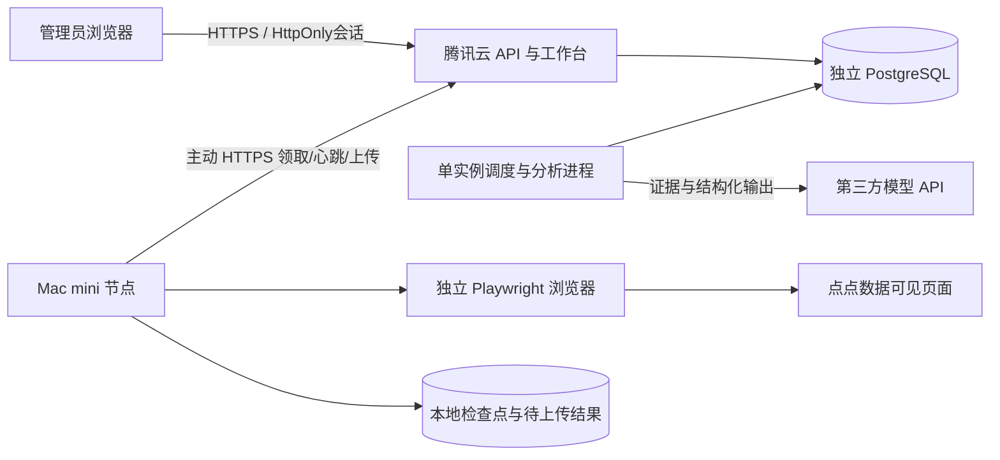

# 机会台：系统设计与实施验收 v3

更新于 2026-09-11。v1/v2 是研究与阶段记录；当前可执行范围以本文件和 README 为准。

## 系统结构

镜析参考：云端管理任务，Mac 主动拉取，租约/心跳驱动重试，独立浏览器与本地恢复文件。差异：本系统把模型研究放在云端，Mac 只处理采集；所有证据与判断分开。云端不能下发任意脚本、文件路径或浏览器选择器，只能引用本机版本化配方。

## 功能与实现

|模块|输入|输出|当前行为|
|---|---|---|---|
|采集目录|已核验市场配方|标准上下文|四个默认入口，可通过代码扩展|
|计划|配方、启停|昨天榜单任务|中国时区、每天幂等一次|
|任务队列|上下文、request_key|租约、状态|60秒租约、15秒心跳；最多5次尝试|
|Mac采集|本地配方与云端上下文|bundle、检查点|串行、可见DOM、目标前100名|
|证据存储|完整/部分结果|原始列、来源、时间|部分结果不进入研究；重复上传幂等|
|趋势研究|已完成同口径快照|候选与7/28/90日名次改善|没有基准日返回未知，不补零|
|模型研究|前15项候选证据|任务假设、证据ID、未知项|结构化验证、缓存、次数限制|
|人工审核|决策、资格结论、证据、实验|持久反馈|进入开发要求已审核资格与证据|
|工作台|真实API|任务/报告/导出|单管理员登录，无模拟数据兜底|

研究列表显示最多200个候选并返回总量。分析进程目前读取已存bundle进行聚合，适合首期验证规模；扩大到全球大规模历史数据前需增量聚合、分区/归档和分页证据存储。不能通过直接增加 analyst 副本扩容：数据库锁保证单实例，以维护模型预算串行语义。

## 机会逻辑

先发现线索，再验证商业机会：同口径榜单变化 → 可见竞品和功能线索 → 付费证据补齐 → 跨市场本地替代品调查 → 具体功能资质核验 → 小规模需求实验 → 决定开发。

当前排序为7日名次改善、观察天数、当前名次，不是收入预测。28/90日也显示但不混算同一个“收益分”。已有 CLI 的日收入/下载增长仅接收完整可比日序列；榜单采集不会生成这些序列。付费榜名次不是付费率，畅销榜不是实际收入。缺少美国竞品也不等于需求空白。

资质矩阵见研究主文档；真正审核单位必须是“功能 × 发布国家 × 渠道 × 运营主体”，不是商店类别标签。所有自动研究默认 UNREVIEWED；人工反馈门槛不代表系统核实了政府批准，也不免除发布前复核。工具、教育、健康等类别可能因具体服务触发不同要求。

## 协议、可靠性与权限

- 业务请求与采集结果均持久化 PostgreSQL；租约凭证与当前状态检查防止旧 worker 覆盖取消/新执行结果。
- Mac 上传网络结果不确定时保留本地 bundle；之后以同 payload+配方摘要重放。登录失效暂停，不持续刷网站。
- 计划按日去重，不会自动回填停机全部日期。排名快照不是每日收入，数据日期必须页面核对。
- 模型 HTTPS、显式供应商/模型；输入最多15项研究证据，适配器另限总字符与输出 token。timeout 等不确定响应进入 UNKNOWN，不自动重试收费请求。每天次数按 UTC 计算；与采集中国日期不同，次数是保守启动计数。
- 模型使用数据视为证据；输出需符合 JSON 结构且引用已有证据ID。结构校验不能保证结论正确，必须人工核验。
- 管理员会话只存随机 token 摘要，12小时失效，生产 Secure/HttpOnly/SameSite Strict；写请求额外检查来源与标头。节点 bearer token 不能访问管理员接口。
- 单管理员内部工具，不具备多租户、完整审计系统或企业级权限体系。Key 只在 env，浏览器不接触模型密钥。

## 验收结果与现场待办

|检查|结果|
|---|---|
|37项单元/接口测试|通过：校验、队列、旧租约、幂等上传、网络重放、模型约束、登录CSRF、计划、报告与审核门槛|
|PostgreSQL17临时容器|通过：10个并发领取唯一、结果持久化、分析队列执行|
|完整Docker镜像|构建通过；非root服务，包含前端资产|
|浏览器Web链路|通过：真实登录、空态、任务提交、报告排队与完成、无数据诚实显示|
|点点实页|四入口DOM观察；iOS前100名连续核对；鸿蒙独立行结构已适配|
|Mac Python现场采集|待专用登录后按交接文档实测四入口|
|云端正式发布/真实模型调用|待真实域名、TLS、服务器配置和供应商密钥|

本版未实现：全世界/全部类别自动发现、详情收入历史采集、跨平台实体自动归并、ASO/SEO数据接入、自动法律资质判定、全球机会收益榜、自动需求实验执行。研究主文档对此的描述是产品路线，不是当前完成事实。

扩展顺序：完成四入口现场验收 → 积累8天可比快照 → 验证真实可访问收入字段 → 扩展国家与类别 → 补充搜索/评论/替代品数据 → 用实际立项和收入反馈校准机会评分。当前系统已提供采集—证据—研究—审核—实验记录的可执行闭环。
